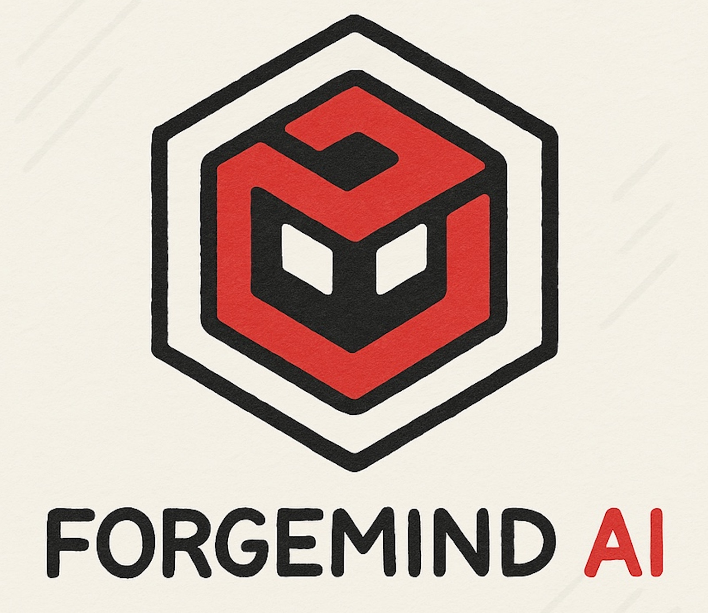
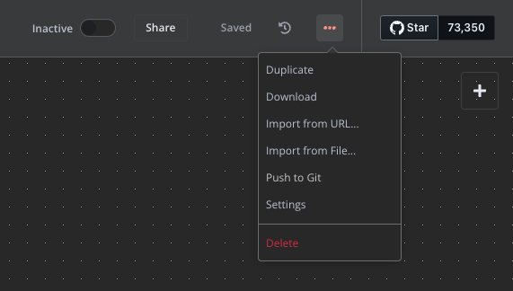

  

# ForgeMindAI - Docker Compose & n8n Workflow

This repository is part of the [ForgeMindAI](https://www.youtube.com/@ForgeMindAI) YouTube channel, where we explore practical AI automation tools and workflows. Here, you'll find a ready-to-use **Docker Compose setup** and a sample **n8n workflow** to kickstart your own AI-powered automation.

## 🛠️ What's Included

- `docker-compose.yml` for quick deployment of n8n, Ollama and supporting services  
- A pre-built n8n workflow to help you get started fast  
- Easy-to-follow instructions and video walkthroughs

## 🎥 Watch the Tutorial

Check out the full tutorial on the ForgeMindAI YouTube channel: [YouTube Link Here]

## To import the workflow to your n8n
* After creating a workflow, go to the 3 dots in the top right corner.
* Select import from file and select this file.
  

* As a prerequisite, you will need to install docker in the command line.
https://docs.docker.com/compose/

* For any queries on this repo, contact us on the following social handles:
Youtube: https://www.youtube.com/@forgemindai
Instagram: https://www.instagram.com/forgemind_ai/reels/

* If you like this repo do star the repo and follow us for more exciting public repos.
